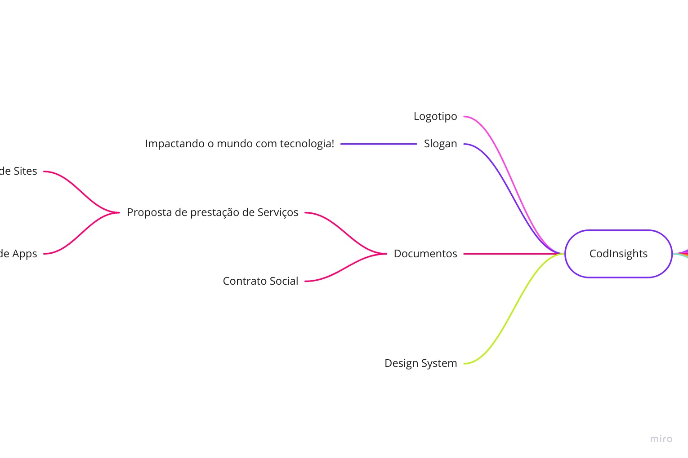

# Website Codinsights </img>
> Startup de desenvolvimento de softwares, aqui misturamos criatividade e bytes para inovar e impactar o mundo real, a partir de agora, suas ideias serão combinadas com o mais alto nível de tecnologia do mercado de softwares do mundo.

#### 1. Qual será seu público-alvo?
> Empresas que querem alcançar seu próximo nível, utilizando alta tecnologia em seus negócios.
#### 2. Como pretende se diferenciar das demais empresas de desenvolvimento?
| Pilar |   |
| ------ | ------ |
|Transparência e confiabilidade. |:bowtie:|
|Escabilidade e desempenho. |:rocket:|
|Disponibilidade em produção. |:heavy_check_mark:|
|Monitoramento. |:chart_with_upwards_trend:|
|Flexibilidade de pagamento |₿itcoin, :credit_card: ou :heavy_dollar_sign:|
#### 3. Se identifica com uma "pegada" mais cool ou mais formal?
> Cool, um tipo de atendimento/tratamento que achamos parecer com o nosso, são os do nubank, iti e/ou startups.
#### 4. Possui alguma estratégia para conquistar clientes?
> primeiro o layout, icones, o que queremos transparecer, é tipo alta tecnologia, inovação, criatividade, futurismo, inteligencia artificial, esse tipo de coisa entende?

> Esses são 3 sites que me remetem isso:

> https://rocketseat.com.br/

> https://www.fiap.com.br/shift/

> https://aeroli.to/

> Dessa forma nosso site ( one page/landing page ) será para os clientes terem esse impacto, e fazerem um pré orçamento com à gente, verem nossos serviços e portifólio saca?

> Segundo seria uma estratégia de pós venda, na finalizações do projeto, talvez pudéssemos enviar brindes, tipo uma caneca, pendrive, caderno com caneta, agenda, alguma bebida com o nosso adesivo com agradecimentos colado na bebida, garrafa de água, chaveiro, copos, ou se tiver em período de pandemia, podemos até presentear com uma máscara, faria sentido com oq estamos vivendo ultimamente.

#### 5. Deseja conquistar pelo produto ou por um tratamento humanizado/privado?
> Queremos que nossos serviços oferecidos façam a captação do cliente, e após isso a gente consiga tratar de forma mais humanizada/privada.
#### 6. "Menos é mais" ou "chegar chegando"?
> Menos é mais, gostamos de conceitos de minimalismo e essencialismo.
#### 7. Como surgiu a ideia-origem do negócio?
> Alguns amigos da área de tecnologia se juntaram, pois possuem muita experiência com desenvolvimento de microsserviços e sites, então notaram que poderam impactar muitas pessoas e negócios com a sua expertise.

| </img> | </img> | </img> |
